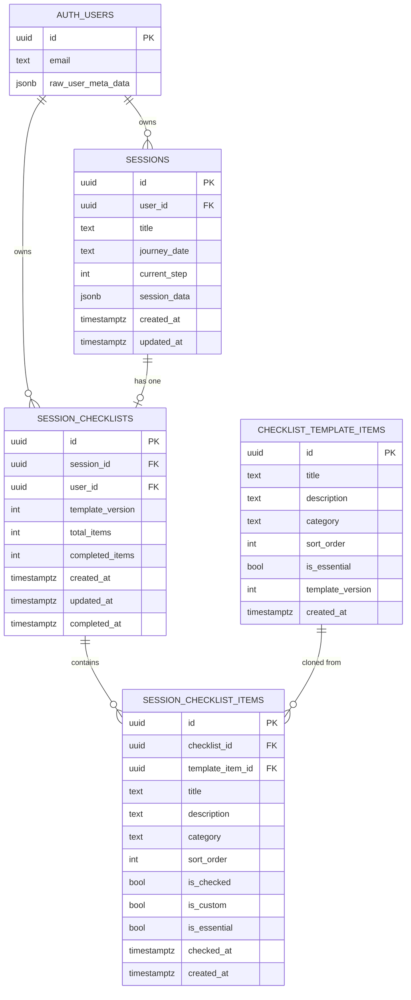

# FEAT-101: Session Day Checklist -- Database Design

**Feature:** FEAT-101 Session Day Checklist
**Author:** Database Architecture
**Date:** 2026-02-09
**Status:** Design Complete -- Ready for Review

---

## Table of Contents

1. [Design Decisions](#1-design-decisions)
2. [Entity Relationship Diagram](#2-entity-relationship-diagram)
3. [Schema Definitions](#3-schema-definitions)
4. [Indexing Strategy](#4-indexing-strategy)
5. [Row Level Security Policies](#5-row-level-security-policies)
6. [Query Patterns](#6-query-patterns)
7. [Migration Script](#7-migration-script)
8. [Data Access Patterns](#8-data-access-patterns)
9. [Migration Strategy](#9-migration-strategy)

---

## 1. Design Decisions

### Q1: Template vs. Instance -- Should we have a separate checklist_templates table?

**Decision: No separate templates table for V1. Use a `checklist_template_items` seed table plus cloning into `session_checklist_items` at instance creation time.**

Rationale:

- The requirements specify a single default template with 18 items. A full-blown template management table (with CRUD for multiple custom templates) is scoped to V2.
- However, we still need the default items defined somewhere server-side so that (a) every client does not hardcode the list, and (b) future template versioning is possible.
- A lightweight `checklist_template_items` table holds the canonical default items. When a user starts a session checklist, we clone those rows into `session_checklist_items` with a link to the session. From that point forward, the instance is independent of the template.
- This gives us: template versioning (add a `template_version` column later), no coupling between live checklists and template changes, and a single source of truth for defaults.

**Alternative considered:** Storing templates as application-level constants (in code). Rejected because it scatters schema logic across frontend and backend, makes template versioning harder, and prevents server-side queries like "which items are most frequently skipped."

### Q2: Normalized items table vs. JSONB array?

**Decision: Normalized. Each checklist item is a row in `session_checklist_items`.**

Rationale:

- The current implementation stores checklist state as a flat `checkedItems` object inside `session_data` JSONB on the `sessions` table. This is fragile: no constraints, no indexing on completion status, no ability to query across sessions ("how many users complete the fasting item?"), and no support for per-item metadata (timestamps, notes).
- A normalized `session_checklist_items` table gives us: per-item RLS (though not needed here since ownership flows through the session), per-item timestamps for when an item was completed, the ability to add/remove individual items without rewriting an entire JSONB blob, and straightforward aggregation queries.
- The downside is more rows and more JOINs, but the volume is tiny (max 50 items per session, max a few sessions per user) so this is not a concern.

**Alternative considered:** JSONB array on a `session_checklists` row. Rejected because it loses per-item timestamps, makes add/remove operations require full rewrite of the array, and prevents SQL-level aggregation.

### Q3: How to handle template versioning?

**Decision: Store a `template_version` integer on `checklist_template_items`. When cloning, record the version used on the `session_checklists` row. Existing session checklists are never retroactively updated.**

This means if we update the default template (say, add item 19), only new sessions get the new item. Old sessions keep their original checklist intact. This is the correct behavior: a user preparing for a session should not have their checklist change mid-preparation.

### Q4: How to store and maintain item order?

**Decision: An integer `sort_order` column on both `checklist_template_items` and `session_checklist_items`.**

Using an integer with gaps (10, 20, 30...) allows inserting custom items between existing ones without renumbering. For the expected scale (max 50 items), renumbering on reorder would also be fine, but gapped integers are simpler for the frontend.

### Q5: How to distinguish default items from user-added custom items?

**Decision: A boolean `is_custom` column on `session_checklist_items`, plus a nullable `template_item_id` foreign key back to `checklist_template_items`.**

Default items cloned from the template have `is_custom = FALSE` and a valid `template_item_id`. User-added items have `is_custom = TRUE` and `template_item_id = NULL`. This lets us cleanly filter and also enables analytics like "which default items do users most often remove."

---

## 2. Entity Relationship Diagram



### Relationship Summary

| Relationship | Type | Description |
|---|---|---|
| `auth.users` -> `sessions` | 1:many | A user owns many sessions |
| `auth.users` -> `session_checklists` | 1:many | A user owns many checklists (denormalized for RLS) |
| `sessions` -> `session_checklists` | 1:1 | Each session has at most one checklist |
| `session_checklists` -> `session_checklist_items` | 1:many | A checklist contains many items |
| `checklist_template_items` -> `session_checklist_items` | 1:many | A template item can be cloned into many session items |

---

## 3. Schema Definitions

### Table 1: `checklist_template_items` (Seed / Reference Data)

This table holds the default checklist items. It is read-only for regular users and managed by administrators or migrations.

```sql
-- ============================================================================
-- TABLE: checklist_template_items
-- ============================================================================
-- Purpose: Canonical default checklist items (seed data)
-- Access: Read-only for users, managed by migrations/admins
-- Expected Volume: ~20 rows (static)

CREATE TABLE IF NOT EXISTS public.checklist_template_items (
    id UUID PRIMARY KEY DEFAULT gen_random_uuid(),

    -- Item Content
    title TEXT NOT NULL,
    description TEXT NOT NULL DEFAULT '',
    category TEXT NOT NULL,

    -- Ordering & Display
    sort_order INTEGER NOT NULL DEFAULT 0,
    is_essential BOOLEAN NOT NULL DEFAULT FALSE,

    -- Versioning
    template_version INTEGER NOT NULL DEFAULT 1,
    is_active BOOLEAN NOT NULL DEFAULT TRUE,

    -- Timestamps
    created_at TIMESTAMPTZ NOT NULL DEFAULT NOW(),

    -- Constraints
    CONSTRAINT checklist_template_title_length CHECK (char_length(title) <= 200),
    CONSTRAINT checklist_template_desc_length CHECK (char_length(description) <= 500),
    CONSTRAINT checklist_template_valid_category CHECK (
        category IN ('physical', 'safety', 'mental', 'practical')
    ),
    CONSTRAINT checklist_template_positive_sort CHECK (sort_order >= 0),
    CONSTRAINT checklist_template_positive_version CHECK (template_version >= 1)
);

COMMENT ON TABLE public.checklist_template_items
    IS 'Default checklist template items for session preparation. Read-only reference data.';
COMMENT ON COLUMN public.checklist_template_items.template_version
    IS 'Version number for template evolution. New versions add rows; old rows stay for existing checklists.';
COMMENT ON COLUMN public.checklist_template_items.is_active
    IS 'Soft delete flag. Set to FALSE to retire an item from new checklists without breaking existing ones.';
```

### Table 2: `session_checklists` (Checklist Instance per Session)

One row per session. Acts as the header/aggregate for a session's checklist.

```sql
-- ============================================================================
-- TABLE: session_checklists
-- ============================================================================
-- Purpose: One checklist instance per session (header record)
-- Access: User owns via user_id, also linked to session
-- Expected Volume: ~1 row per session per user

CREATE TABLE IF NOT EXISTS public.session_checklists (
    id UUID PRIMARY KEY DEFAULT gen_random_uuid(),

    -- Ownership & Linking
    session_id UUID NOT NULL REFERENCES public.sessions(id) ON DELETE CASCADE,
    user_id UUID NOT NULL REFERENCES auth.users(id) ON DELETE CASCADE,

    -- Template Tracking
    template_version INTEGER NOT NULL DEFAULT 1,

    -- Aggregate Counters (denormalized for fast reads)
    total_items INTEGER NOT NULL DEFAULT 0,
    completed_items INTEGER NOT NULL DEFAULT 0,

    -- Timestamps
    created_at TIMESTAMPTZ NOT NULL DEFAULT NOW(),
    updated_at TIMESTAMPTZ NOT NULL DEFAULT NOW(),
    completed_at TIMESTAMPTZ,  -- Set when all items checked

    -- Constraints
    CONSTRAINT session_checklists_one_per_session UNIQUE (session_id),
    CONSTRAINT session_checklists_completed_lte_total CHECK (completed_items <= total_items),
    CONSTRAINT session_checklists_non_negative_counts CHECK (
        total_items >= 0 AND completed_items >= 0
    )
);

COMMENT ON TABLE public.session_checklists
    IS 'Checklist instance header for a session. One per session. Tracks aggregate completion.';
COMMENT ON COLUMN public.session_checklists.user_id
    IS 'Denormalized from sessions.user_id for direct RLS enforcement without JOIN.';
COMMENT ON COLUMN public.session_checklists.completed_at
    IS 'Timestamp when all items were checked. NULL if not fully complete.';
```

### Table 3: `session_checklist_items` (Individual Items)

One row per checklist item per session. Both default-cloned and user-added items live here.

```sql
-- ============================================================================
-- TABLE: session_checklist_items
-- ============================================================================
-- Purpose: Individual checklist items belonging to a session checklist
-- Access: Ownership enforced through checklist_id -> session_checklists.user_id
-- Expected Volume: ~20-50 rows per checklist

CREATE TABLE IF NOT EXISTS public.session_checklist_items (
    id UUID PRIMARY KEY DEFAULT gen_random_uuid(),

    -- Parent Checklist
    checklist_id UUID NOT NULL REFERENCES public.session_checklists(id) ON DELETE CASCADE,

    -- Template Lineage (NULL for custom items)
    template_item_id UUID REFERENCES public.checklist_template_items(id) ON DELETE SET NULL,

    -- Item Content
    title TEXT NOT NULL,
    description TEXT NOT NULL DEFAULT '',
    category TEXT NOT NULL DEFAULT 'practical',

    -- Ordering & Display
    sort_order INTEGER NOT NULL DEFAULT 0,
    is_essential BOOLEAN NOT NULL DEFAULT FALSE,
    is_custom BOOLEAN NOT NULL DEFAULT FALSE,

    -- Completion State
    is_checked BOOLEAN NOT NULL DEFAULT FALSE,
    checked_at TIMESTAMPTZ,  -- When the item was checked off

    -- Timestamps
    created_at TIMESTAMPTZ NOT NULL DEFAULT NOW(),

    -- Constraints
    CONSTRAINT checklist_item_title_length CHECK (char_length(title) <= 200),
    CONSTRAINT checklist_item_desc_length CHECK (char_length(description) <= 500),
    CONSTRAINT checklist_item_valid_category CHECK (
        category IN ('physical', 'safety', 'mental', 'practical')
    ),
    CONSTRAINT checklist_item_positive_sort CHECK (sort_order >= 0),
    CONSTRAINT checklist_item_checked_consistency CHECK (
        (is_checked = TRUE AND checked_at IS NOT NULL)
        OR (is_checked = FALSE AND checked_at IS NULL)
    )
);

COMMENT ON TABLE public.session_checklist_items
    IS 'Individual checklist items for a session. Cloned from template or user-created.';
COMMENT ON COLUMN public.session_checklist_items.template_item_id
    IS 'References the template item this was cloned from. NULL for custom user-added items.';
COMMENT ON COLUMN public.session_checklist_items.is_custom
    IS 'TRUE for user-added items, FALSE for items cloned from the default template.';
COMMENT ON COLUMN public.session_checklist_items.checked_at
    IS 'Timestamp when the user checked this item. NULL if unchecked.';
```

---

## 4. Indexing Strategy

### checklist_template_items

```sql
-- Primary query: fetch all active items for current version, ordered
CREATE INDEX idx_template_items_active_version
    ON public.checklist_template_items(template_version, sort_order)
    WHERE is_active = TRUE;
```

Rationale: The only query against this table is "give me all active items for the latest template version, in order." A partial index on `is_active = TRUE` with a composite on `(template_version, sort_order)` covers this perfectly as an index-only scan.

### session_checklists

```sql
-- Primary query: fetch checklist for a given session
-- The UNIQUE constraint on session_id already creates an implicit unique index.
-- No additional index needed for session_id lookups.

-- User's checklists ordered by recency (for "my checklists" list view)
CREATE INDEX idx_session_checklists_user_time
    ON public.session_checklists(user_id, created_at DESC);

-- Find incomplete checklists (for reminders, nudges)
CREATE INDEX idx_session_checklists_incomplete
    ON public.session_checklists(user_id, updated_at DESC)
    WHERE completed_at IS NULL;
```

Rationale:
- The `UNIQUE(session_id)` constraint generates an implicit B-tree index, so looking up a checklist by session ID is already fast.
- The `(user_id, created_at DESC)` composite supports listing a user's checklists in reverse chronological order. RLS will filter by `user_id` anyway, so this index supports the RLS predicate plus the sort.
- The partial index on incomplete checklists supports a future "reminder" feature and admin analytics ("how many users abandon their checklist?").

### session_checklist_items

```sql
-- Primary query: fetch all items for a checklist, ordered
CREATE INDEX idx_checklist_items_checklist_order
    ON public.session_checklist_items(checklist_id, sort_order);

-- Analytics: which template items are most/least checked?
CREATE INDEX idx_checklist_items_template_checked
    ON public.session_checklist_items(template_item_id, is_checked)
    WHERE template_item_id IS NOT NULL;
```

Rationale:
- The primary access pattern is "load all items for checklist X, sorted by sort_order." The composite `(checklist_id, sort_order)` serves this directly.
- The analytics index on `(template_item_id, is_checked)` enables queries like "what percentage of users check the fasting item?" This is a partial index excluding custom items (which have no template_item_id).

### Index Budget Summary

| Table | Indexes | Type | Purpose |
|---|---|---|---|
| `checklist_template_items` | 1 + PK | Partial B-tree | Active items by version |
| `session_checklists` | 2 + PK + UNIQUE | B-tree, Partial B-tree | User listing, incomplete filter |
| `session_checklist_items` | 2 + PK | B-tree, Partial B-tree | Item loading, analytics |

Total: 5 custom indexes across 3 tables. This is conservative and appropriate for the expected volume.

---

## 5. Row Level Security Policies

### checklist_template_items -- Public Read-Only

```sql
ALTER TABLE public.checklist_template_items ENABLE ROW LEVEL SECURITY;

-- All authenticated users can read template items (reference data)
CREATE POLICY "Authenticated users can read checklist templates"
    ON public.checklist_template_items
    FOR SELECT
    USING (auth.uid() IS NOT NULL);

-- Only admins can modify template items
CREATE POLICY "Admins can manage checklist templates"
    ON public.checklist_template_items
    FOR ALL
    USING (public.is_admin())
    WITH CHECK (public.is_admin());
```

Rationale: Template items are shared reference data. Any authenticated user can read them (needed to create a new checklist). Only admins can insert, update, or delete template items.

### session_checklists -- User Owns Own Data

```sql
ALTER TABLE public.session_checklists ENABLE ROW LEVEL SECURITY;

-- Users can read their own checklists
CREATE POLICY "Users can view own session checklists"
    ON public.session_checklists
    FOR SELECT
    USING (auth.uid() = user_id);

-- Users can create checklists for their own sessions
CREATE POLICY "Users can create own session checklists"
    ON public.session_checklists
    FOR INSERT
    WITH CHECK (
        auth.uid() = user_id
        AND EXISTS (
            SELECT 1 FROM public.sessions s
            WHERE s.id = session_id
            AND s.user_id = auth.uid()
        )
    );

-- Users can update their own checklists
CREATE POLICY "Users can update own session checklists"
    ON public.session_checklists
    FOR UPDATE
    USING (auth.uid() = user_id)
    WITH CHECK (auth.uid() = user_id);

-- Users can delete their own checklists
CREATE POLICY "Users can delete own session checklists"
    ON public.session_checklists
    FOR DELETE
    USING (auth.uid() = user_id);
```

Rationale:
- The `user_id` column on `session_checklists` is denormalized from `sessions.user_id` specifically so that RLS does not need a JOIN for SELECT/UPDATE/DELETE -- this is a significant performance consideration since every single query hits RLS.
- The INSERT policy adds a cross-check that the referenced session actually belongs to the user. This prevents a user from attaching a checklist to someone else's session.

### session_checklist_items -- Ownership Through Parent

```sql
ALTER TABLE public.session_checklist_items ENABLE ROW LEVEL SECURITY;

-- Users can read items belonging to their own checklists
CREATE POLICY "Users can view own checklist items"
    ON public.session_checklist_items
    FOR SELECT
    USING (
        EXISTS (
            SELECT 1 FROM public.session_checklists sc
            WHERE sc.id = checklist_id
            AND sc.user_id = auth.uid()
        )
    );

-- Users can add items to their own checklists (max 50 enforced at app level)
CREATE POLICY "Users can add items to own checklists"
    ON public.session_checklist_items
    FOR INSERT
    WITH CHECK (
        EXISTS (
            SELECT 1 FROM public.session_checklists sc
            WHERE sc.id = checklist_id
            AND sc.user_id = auth.uid()
        )
    );

-- Users can update items in their own checklists
CREATE POLICY "Users can update own checklist items"
    ON public.session_checklist_items
    FOR UPDATE
    USING (
        EXISTS (
            SELECT 1 FROM public.session_checklists sc
            WHERE sc.id = checklist_id
            AND sc.user_id = auth.uid()
        )
    )
    WITH CHECK (
        EXISTS (
            SELECT 1 FROM public.session_checklists sc
            WHERE sc.id = checklist_id
            AND sc.user_id = auth.uid()
        )
    );

-- Users can delete items from their own checklists
CREATE POLICY "Users can delete own checklist items"
    ON public.session_checklist_items
    FOR DELETE
    USING (
        EXISTS (
            SELECT 1 FROM public.session_checklists sc
            WHERE sc.id = checklist_id
            AND sc.user_id = auth.uid()
        )
    );
```

Rationale:
- Items do not have their own `user_id`. Ownership is determined by the parent `session_checklists.user_id`. This requires a subquery in RLS policies, but the parent table is tiny per user and the `checklist_id` lookup uses the primary key index, so performance is excellent.
- This pattern is standard for child entities in Supabase applications.

---

## 6. Query Patterns

### 6.1 Create a New Checklist for a Session

This is the most important write operation. When a user opens session preparation, the app checks if a checklist exists for this session. If not, it creates one by cloning template items.

```sql
-- Step 1: Create the checklist header
INSERT INTO public.session_checklists (session_id, user_id, template_version, total_items)
SELECT
    $1,                          -- session_id parameter
    $2,                          -- user_id parameter
    MAX(template_version),       -- latest template version
    COUNT(*)                     -- total items being cloned
FROM public.checklist_template_items
WHERE is_active = TRUE
RETURNING id, template_version;

-- Step 2: Clone template items into session checklist items
INSERT INTO public.session_checklist_items (
    checklist_id, template_item_id, title, description,
    category, sort_order, is_essential, is_custom
)
SELECT
    $3,                          -- checklist_id from Step 1
    id,                          -- template_item_id
    title,
    description,
    category,
    sort_order,
    is_essential,
    FALSE                        -- is_custom = FALSE (from template)
FROM public.checklist_template_items
WHERE is_active = TRUE
ORDER BY sort_order;
```

### 6.2 Fetch Checklist for a Session

The primary read operation. Load the checklist header and all items in one round-trip using Supabase's nested select.

```javascript
// Supabase JS client query
const { data, error } = await supabase
    .from('session_checklists')
    .select(`
        id,
        session_id,
        template_version,
        total_items,
        completed_items,
        completed_at,
        created_at,
        updated_at,
        session_checklist_items (
            id,
            title,
            description,
            category,
            sort_order,
            is_essential,
            is_custom,
            is_checked,
            checked_at
        )
    `)
    .eq('session_id', sessionId)
    .single();
```

Equivalent SQL:

```sql
SELECT
    sc.id, sc.session_id, sc.template_version,
    sc.total_items, sc.completed_items, sc.completed_at,
    sci.id AS item_id, sci.title, sci.description,
    sci.category, sci.sort_order, sci.is_essential,
    sci.is_custom, sci.is_checked, sci.checked_at
FROM public.session_checklists sc
LEFT JOIN public.session_checklist_items sci
    ON sci.checklist_id = sc.id
WHERE sc.session_id = $1
ORDER BY sci.sort_order;
```

### 6.3 Toggle Item Completion

Single item check/uncheck. Updates the item and the parent aggregate.

```sql
-- Toggle item checked state
UPDATE public.session_checklist_items
SET
    is_checked = NOT is_checked,
    checked_at = CASE
        WHEN is_checked = FALSE THEN NOW()  -- checking: set timestamp
        ELSE NULL                            -- unchecking: clear timestamp
    END
WHERE id = $1
RETURNING is_checked;

-- Update parent aggregate counter
UPDATE public.session_checklists
SET
    completed_items = (
        SELECT COUNT(*) FROM public.session_checklist_items
        WHERE checklist_id = $2 AND is_checked = TRUE
    ),
    completed_at = CASE
        WHEN (SELECT COUNT(*) FROM public.session_checklist_items
              WHERE checklist_id = $2 AND is_checked = TRUE)
           = total_items
        THEN NOW()
        ELSE NULL
    END,
    updated_at = NOW()
WHERE id = $2;
```

### 6.4 Add a Custom Item

```sql
-- Insert custom item
INSERT INTO public.session_checklist_items (
    checklist_id, title, description, category,
    sort_order, is_essential, is_custom
)
VALUES (
    $1,             -- checklist_id
    $2,             -- title
    $3,             -- description
    $4,             -- category (default 'practical')
    (SELECT COALESCE(MAX(sort_order), 0) + 10
     FROM public.session_checklist_items
     WHERE checklist_id = $1),
    FALSE,          -- is_essential
    TRUE            -- is_custom
)
RETURNING *;

-- Update total_items counter
UPDATE public.session_checklists
SET total_items = total_items + 1, updated_at = NOW()
WHERE id = $1;
```

### 6.5 Remove an Item

```sql
-- Delete the item
DELETE FROM public.session_checklist_items
WHERE id = $1 AND checklist_id = $2;

-- Update counters
UPDATE public.session_checklists
SET
    total_items = (
        SELECT COUNT(*) FROM public.session_checklist_items
        WHERE checklist_id = $2
    ),
    completed_items = (
        SELECT COUNT(*) FROM public.session_checklist_items
        WHERE checklist_id = $2 AND is_checked = TRUE
    ),
    updated_at = NOW()
WHERE id = $2;
```

### 6.6 Edit an Item's Title/Description

```sql
UPDATE public.session_checklist_items
SET title = $2, description = $3
WHERE id = $1;
```

### 6.7 Analytics: Template Item Completion Rates (Admin)

```sql
SELECT
    cti.title,
    cti.category,
    COUNT(sci.id) AS times_used,
    COUNT(sci.id) FILTER (WHERE sci.is_checked = TRUE) AS times_completed,
    ROUND(
        100.0 * COUNT(sci.id) FILTER (WHERE sci.is_checked = TRUE) / NULLIF(COUNT(sci.id), 0),
        1
    ) AS completion_rate_pct
FROM public.checklist_template_items cti
LEFT JOIN public.session_checklist_items sci
    ON sci.template_item_id = cti.id
WHERE cti.is_active = TRUE
GROUP BY cti.id, cti.title, cti.category
ORDER BY completion_rate_pct ASC;
```

---

## 7. Migration Script

The complete, production-ready migration follows. It is idempotent (uses `IF NOT EXISTS`) and can be rolled back with the companion rollback section.

```sql
-- ============================================================================
-- FEAT-101: Session Day Checklist Schema Migration
-- ============================================================================
-- Feature: FEAT-101
-- Version: 1.0
-- Date: 2026-02-09
-- Description: Creates checklist template, session checklist, and checklist
--              items tables for the Session Day Checklist feature.
-- Depends on: sessions table, auth.users, is_admin() function
-- ============================================================================

BEGIN;

-- ============================================================================
-- TABLE 1: checklist_template_items
-- ============================================================================

CREATE TABLE IF NOT EXISTS public.checklist_template_items (
    id UUID PRIMARY KEY DEFAULT gen_random_uuid(),
    title TEXT NOT NULL,
    description TEXT NOT NULL DEFAULT '',
    category TEXT NOT NULL,
    sort_order INTEGER NOT NULL DEFAULT 0,
    is_essential BOOLEAN NOT NULL DEFAULT FALSE,
    template_version INTEGER NOT NULL DEFAULT 1,
    is_active BOOLEAN NOT NULL DEFAULT TRUE,
    created_at TIMESTAMPTZ NOT NULL DEFAULT NOW(),

    CONSTRAINT checklist_template_title_length CHECK (char_length(title) <= 200),
    CONSTRAINT checklist_template_desc_length CHECK (char_length(description) <= 500),
    CONSTRAINT checklist_template_valid_category CHECK (
        category IN ('physical', 'safety', 'mental', 'practical')
    ),
    CONSTRAINT checklist_template_positive_sort CHECK (sort_order >= 0),
    CONSTRAINT checklist_template_positive_version CHECK (template_version >= 1)
);

COMMENT ON TABLE public.checklist_template_items
    IS 'Default checklist template items for session preparation. Read-only reference data.';

-- Index
CREATE INDEX IF NOT EXISTS idx_template_items_active_version
    ON public.checklist_template_items(template_version, sort_order)
    WHERE is_active = TRUE;

-- RLS
ALTER TABLE public.checklist_template_items ENABLE ROW LEVEL SECURITY;

CREATE POLICY "Authenticated users can read checklist templates"
    ON public.checklist_template_items
    FOR SELECT
    USING (auth.uid() IS NOT NULL);

CREATE POLICY "Admins can manage checklist templates"
    ON public.checklist_template_items
    FOR ALL
    USING (public.is_admin())
    WITH CHECK (public.is_admin());

-- ============================================================================
-- TABLE 2: session_checklists
-- ============================================================================

CREATE TABLE IF NOT EXISTS public.session_checklists (
    id UUID PRIMARY KEY DEFAULT gen_random_uuid(),
    session_id UUID NOT NULL REFERENCES public.sessions(id) ON DELETE CASCADE,
    user_id UUID NOT NULL REFERENCES auth.users(id) ON DELETE CASCADE,
    template_version INTEGER NOT NULL DEFAULT 1,
    total_items INTEGER NOT NULL DEFAULT 0,
    completed_items INTEGER NOT NULL DEFAULT 0,
    created_at TIMESTAMPTZ NOT NULL DEFAULT NOW(),
    updated_at TIMESTAMPTZ NOT NULL DEFAULT NOW(),
    completed_at TIMESTAMPTZ,

    CONSTRAINT session_checklists_one_per_session UNIQUE (session_id),
    CONSTRAINT session_checklists_completed_lte_total CHECK (completed_items <= total_items),
    CONSTRAINT session_checklists_non_negative_counts CHECK (
        total_items >= 0 AND completed_items >= 0
    )
);

COMMENT ON TABLE public.session_checklists
    IS 'Checklist instance header for a session. One per session.';

-- Indexes
CREATE INDEX IF NOT EXISTS idx_session_checklists_user_time
    ON public.session_checklists(user_id, created_at DESC);

CREATE INDEX IF NOT EXISTS idx_session_checklists_incomplete
    ON public.session_checklists(user_id, updated_at DESC)
    WHERE completed_at IS NULL;

-- RLS
ALTER TABLE public.session_checklists ENABLE ROW LEVEL SECURITY;

CREATE POLICY "Users can view own session checklists"
    ON public.session_checklists
    FOR SELECT
    USING (auth.uid() = user_id);

CREATE POLICY "Users can create own session checklists"
    ON public.session_checklists
    FOR INSERT
    WITH CHECK (
        auth.uid() = user_id
        AND EXISTS (
            SELECT 1 FROM public.sessions s
            WHERE s.id = session_id
            AND s.user_id = auth.uid()
        )
    );

CREATE POLICY "Users can update own session checklists"
    ON public.session_checklists
    FOR UPDATE
    USING (auth.uid() = user_id)
    WITH CHECK (auth.uid() = user_id);

CREATE POLICY "Users can delete own session checklists"
    ON public.session_checklists
    FOR DELETE
    USING (auth.uid() = user_id);

-- ============================================================================
-- TABLE 3: session_checklist_items
-- ============================================================================

CREATE TABLE IF NOT EXISTS public.session_checklist_items (
    id UUID PRIMARY KEY DEFAULT gen_random_uuid(),
    checklist_id UUID NOT NULL REFERENCES public.session_checklists(id) ON DELETE CASCADE,
    template_item_id UUID REFERENCES public.checklist_template_items(id) ON DELETE SET NULL,
    title TEXT NOT NULL,
    description TEXT NOT NULL DEFAULT '',
    category TEXT NOT NULL DEFAULT 'practical',
    sort_order INTEGER NOT NULL DEFAULT 0,
    is_essential BOOLEAN NOT NULL DEFAULT FALSE,
    is_custom BOOLEAN NOT NULL DEFAULT FALSE,
    is_checked BOOLEAN NOT NULL DEFAULT FALSE,
    checked_at TIMESTAMPTZ,
    created_at TIMESTAMPTZ NOT NULL DEFAULT NOW(),

    CONSTRAINT checklist_item_title_length CHECK (char_length(title) <= 200),
    CONSTRAINT checklist_item_desc_length CHECK (char_length(description) <= 500),
    CONSTRAINT checklist_item_valid_category CHECK (
        category IN ('physical', 'safety', 'mental', 'practical')
    ),
    CONSTRAINT checklist_item_positive_sort CHECK (sort_order >= 0),
    CONSTRAINT checklist_item_checked_consistency CHECK (
        (is_checked = TRUE AND checked_at IS NOT NULL)
        OR (is_checked = FALSE AND checked_at IS NULL)
    )
);

COMMENT ON TABLE public.session_checklist_items
    IS 'Individual checklist items for a session. Cloned from template or user-created.';

-- Indexes
CREATE INDEX IF NOT EXISTS idx_checklist_items_checklist_order
    ON public.session_checklist_items(checklist_id, sort_order);

CREATE INDEX IF NOT EXISTS idx_checklist_items_template_checked
    ON public.session_checklist_items(template_item_id, is_checked)
    WHERE template_item_id IS NOT NULL;

-- RLS
ALTER TABLE public.session_checklist_items ENABLE ROW LEVEL SECURITY;

CREATE POLICY "Users can view own checklist items"
    ON public.session_checklist_items
    FOR SELECT
    USING (
        EXISTS (
            SELECT 1 FROM public.session_checklists sc
            WHERE sc.id = checklist_id
            AND sc.user_id = auth.uid()
        )
    );

CREATE POLICY "Users can add items to own checklists"
    ON public.session_checklist_items
    FOR INSERT
    WITH CHECK (
        EXISTS (
            SELECT 1 FROM public.session_checklists sc
            WHERE sc.id = checklist_id
            AND sc.user_id = auth.uid()
        )
    );

CREATE POLICY "Users can update own checklist items"
    ON public.session_checklist_items
    FOR UPDATE
    USING (
        EXISTS (
            SELECT 1 FROM public.session_checklists sc
            WHERE sc.id = checklist_id
            AND sc.user_id = auth.uid()
        )
    )
    WITH CHECK (
        EXISTS (
            SELECT 1 FROM public.session_checklists sc
            WHERE sc.id = checklist_id
            AND sc.user_id = auth.uid()
        )
    );

CREATE POLICY "Users can delete own checklist items"
    ON public.session_checklist_items
    FOR DELETE
    USING (
        EXISTS (
            SELECT 1 FROM public.session_checklists sc
            WHERE sc.id = checklist_id
            AND sc.user_id = auth.uid()
        )
    );

-- ============================================================================
-- TRIGGER: Auto-update session_checklists counters
-- ============================================================================
-- Keeps total_items and completed_items in sync automatically when
-- items are inserted, updated, or deleted.

CREATE OR REPLACE FUNCTION public.update_checklist_counters()
RETURNS TRIGGER AS $$
DECLARE
    target_checklist_id UUID;
BEGIN
    -- Determine which checklist to update
    IF TG_OP = 'DELETE' THEN
        target_checklist_id := OLD.checklist_id;
    ELSE
        target_checklist_id := NEW.checklist_id;
    END IF;

    -- Recount items and completed items
    UPDATE public.session_checklists
    SET
        total_items = (
            SELECT COUNT(*)
            FROM public.session_checklist_items
            WHERE checklist_id = target_checklist_id
        ),
        completed_items = (
            SELECT COUNT(*)
            FROM public.session_checklist_items
            WHERE checklist_id = target_checklist_id AND is_checked = TRUE
        ),
        completed_at = CASE
            WHEN (SELECT COUNT(*) FROM public.session_checklist_items
                  WHERE checklist_id = target_checklist_id AND is_checked = TRUE)
               = (SELECT COUNT(*) FROM public.session_checklist_items
                  WHERE checklist_id = target_checklist_id)
                 AND (SELECT COUNT(*) FROM public.session_checklist_items
                      WHERE checklist_id = target_checklist_id) > 0
            THEN COALESCE(
                (SELECT completed_at FROM public.session_checklists
                 WHERE id = target_checklist_id),
                NOW()
            )
            ELSE NULL
        END,
        updated_at = NOW()
    WHERE id = target_checklist_id;

    IF TG_OP = 'DELETE' THEN
        RETURN OLD;
    ELSE
        RETURN NEW;
    END IF;
END;
$$ LANGUAGE plpgsql;

CREATE TRIGGER trigger_update_checklist_counters
    AFTER INSERT OR UPDATE OF is_checked OR DELETE
    ON public.session_checklist_items
    FOR EACH ROW
    EXECUTE FUNCTION public.update_checklist_counters();

COMMENT ON FUNCTION public.update_checklist_counters()
    IS 'Automatically recounts total_items and completed_items on session_checklists when items change.';

-- ============================================================================
-- FUNCTION: Create checklist from template
-- ============================================================================
-- Server-side function to atomically create a checklist and clone
-- template items in one call.

CREATE OR REPLACE FUNCTION public.create_session_checklist(
    p_session_id UUID,
    p_user_id UUID
)
RETURNS UUID AS $$
DECLARE
    v_checklist_id UUID;
    v_template_version INTEGER;
    v_item_count INTEGER;
BEGIN
    -- Verify the session belongs to the user
    IF NOT EXISTS (
        SELECT 1 FROM public.sessions
        WHERE id = p_session_id AND user_id = p_user_id
    ) THEN
        RAISE EXCEPTION 'Session % does not belong to user %', p_session_id, p_user_id;
    END IF;

    -- Check if checklist already exists for this session
    SELECT id INTO v_checklist_id
    FROM public.session_checklists
    WHERE session_id = p_session_id;

    IF v_checklist_id IS NOT NULL THEN
        RETURN v_checklist_id;  -- Return existing checklist
    END IF;

    -- Get current template version
    SELECT COALESCE(MAX(template_version), 1) INTO v_template_version
    FROM public.checklist_template_items
    WHERE is_active = TRUE;

    -- Count items to be cloned
    SELECT COUNT(*) INTO v_item_count
    FROM public.checklist_template_items
    WHERE is_active = TRUE;

    -- Create checklist header
    INSERT INTO public.session_checklists (
        session_id, user_id, template_version, total_items
    ) VALUES (
        p_session_id, p_user_id, v_template_version, v_item_count
    )
    RETURNING id INTO v_checklist_id;

    -- Clone template items
    INSERT INTO public.session_checklist_items (
        checklist_id, template_item_id, title, description,
        category, sort_order, is_essential, is_custom
    )
    SELECT
        v_checklist_id,
        id,
        title,
        description,
        category,
        sort_order,
        is_essential,
        FALSE
    FROM public.checklist_template_items
    WHERE is_active = TRUE
    ORDER BY sort_order;

    RETURN v_checklist_id;
END;
$$ LANGUAGE plpgsql SECURITY DEFINER;

COMMENT ON FUNCTION public.create_session_checklist(UUID, UUID)
    IS 'Atomically creates a session checklist by cloning active template items. Returns existing checklist ID if one already exists.';

-- ============================================================================
-- SEED DATA: Default Template Items (18 items)
-- ============================================================================

INSERT INTO public.checklist_template_items
    (title, description, category, sort_order, is_essential, template_version)
VALUES
    -- Physical Preparation (sort_order 100-190)
    ('Follow fasting guidelines',
     'Adhere to recommended dietary restrictions before your session',
     'physical', 100, TRUE, 1),

    ('Stay hydrated',
     'Drink plenty of water throughout the day leading up to your session',
     'physical', 110, TRUE, 1),

    ('Get adequate sleep',
     'Aim for 7-9 hours of restful sleep the night before',
     'physical', 120, TRUE, 1),

    ('Prepare light meals',
     'Have easily digestible food available for before and after your session',
     'physical', 130, FALSE, 1),

    ('Avoid alcohol and recreational substances',
     'Abstain from alcohol and other substances for at least 24-48 hours before',
     'physical', 140, TRUE, 1),

    -- Safety & Support (sort_order 200-290)
    ('Confirm sitter or guide',
     'Ensure your trusted companion or facilitator is confirmed and prepared',
     'safety', 200, TRUE, 1),

    ('Share plans with trusted person',
     'Let someone you trust know your plans, location, and expected timeline',
     'safety', 210, TRUE, 1),

    ('Prepare emergency contacts',
     'Have a list of emergency contacts easily accessible including your therapist if applicable',
     'safety', 220, TRUE, 1),

    ('Review harm reduction resources',
     'Familiarize yourself with dosage guidelines, contraindications, and safety protocols',
     'safety', 230, TRUE, 1),

    -- Mental/Emotional (sort_order 300-390)
    ('Set your intentions',
     'Write down clear intentions for your session in your journal or in this app',
     'mental', 300, TRUE, 1),

    ('Journal your current state',
     'Write about how you are feeling physically, emotionally, and mentally right now',
     'mental', 310, FALSE, 1),

    ('Practice meditation or breathwork',
     'Spend 10-20 minutes in quiet meditation or calming breathwork to center yourself',
     'mental', 320, FALSE, 1),

    ('Release expectations',
     'Consciously let go of specific outcomes and practice openness to whatever arises',
     'mental', 330, FALSE, 1),

    -- Practical (sort_order 400-490)
    ('Prepare your space',
     'Create a comfortable, safe, and clean environment with blankets, pillows, and low lighting',
     'practical', 400, TRUE, 1),

    ('Gather supplies',
     'Eye mask, headphones, journal, pen, water, tissues, comfort objects',
     'practical', 410, TRUE, 1),

    ('Prepare your music playlist',
     'Have your curated playlist ready and tested on your preferred device',
     'practical', 420, FALSE, 1),

    ('Set phone to airplane mode or off',
     'Minimize interruptions by silencing or turning off electronic devices',
     'practical', 430, TRUE, 1),

    ('Clear your schedule',
     'Ensure you have no obligations for the session duration and at least 24 hours after for integration',
     'practical', 440, TRUE, 1)

ON CONFLICT DO NOTHING;

-- ============================================================================
-- GDPR: Extend user data deletion function
-- ============================================================================

CREATE OR REPLACE FUNCTION public.delete_user_checklist_data(target_user_id UUID)
RETURNS void AS $$
BEGIN
    -- Authorization check
    IF auth.uid() != target_user_id AND NOT public.is_admin() THEN
        RAISE EXCEPTION 'Unauthorized: You can only delete your own checklist data.';
    END IF;

    -- Delete checklists (cascades to items)
    DELETE FROM public.session_checklists WHERE user_id = target_user_id;

    RAISE NOTICE 'Deleted all checklist data for user %', target_user_id;
END;
$$ LANGUAGE plpgsql SECURITY DEFINER;

COMMENT ON FUNCTION public.delete_user_checklist_data(UUID)
    IS 'GDPR-compliant deletion of user checklist data. Cascades to items.';

COMMIT;

-- ============================================================================
-- MIGRATION COMPLETE
-- ============================================================================
```

### Rollback Script

```sql
-- ============================================================================
-- FEAT-101: Session Day Checklist -- ROLLBACK
-- ============================================================================
-- WARNING: This permanently deletes all checklist data.
-- ============================================================================

BEGIN;

-- Drop trigger first
DROP TRIGGER IF EXISTS trigger_update_checklist_counters
    ON public.session_checklist_items;

-- Drop functions
DROP FUNCTION IF EXISTS public.update_checklist_counters();
DROP FUNCTION IF EXISTS public.create_session_checklist(UUID, UUID);
DROP FUNCTION IF EXISTS public.delete_user_checklist_data(UUID);

-- Drop tables in dependency order (children first)
DROP TABLE IF EXISTS public.session_checklist_items CASCADE;
DROP TABLE IF EXISTS public.session_checklists CASCADE;
DROP TABLE IF EXISTS public.checklist_template_items CASCADE;

COMMIT;
```

---

## 8. Data Access Patterns

### 8.1 Recommended Service Layer Interface

The frontend should interact through a dedicated `checklistService.js` module.

```javascript
// lib/checklistService.js -- Suggested interface

/**
 * Get or create a checklist for a session.
 * Calls the server-side create_session_checklist() function which is
 * idempotent -- returns existing checklist if one already exists.
 *
 * @param {string} sessionId - UUID of the session
 * @param {string} userId - UUID of the authenticated user
 * @returns {Object} Checklist with nested items
 */
async function getOrCreateChecklist(sessionId, userId) {
    // Step 1: Try to fetch existing checklist
    const { data: existing } = await supabase
        .from('session_checklists')
        .select(`
            *,
            session_checklist_items (*)
        `)
        .eq('session_id', sessionId)
        .maybeSingle();

    if (existing) return existing;

    // Step 2: Create via server function (atomic clone)
    const { data: result } = await supabase
        .rpc('create_session_checklist', {
            p_session_id: sessionId,
            p_user_id: userId
        });

    // Step 3: Fetch the newly created checklist with items
    const { data } = await supabase
        .from('session_checklists')
        .select(`
            *,
            session_checklist_items (*)
        `)
        .eq('session_id', sessionId)
        .single();

    return data;
}

/**
 * Toggle a checklist item's completion status.
 *
 * @param {string} itemId - UUID of the checklist item
 * @param {boolean} isChecked - New checked state
 * @returns {Object} Updated item
 */
async function toggleItem(itemId, isChecked) {
    const { data } = await supabase
        .from('session_checklist_items')
        .update({
            is_checked: isChecked,
            checked_at: isChecked ? new Date().toISOString() : null
        })
        .eq('id', itemId)
        .select()
        .single();

    // The trigger automatically updates parent counters
    return data;
}

/**
 * Add a custom item to a checklist.
 *
 * @param {string} checklistId - UUID of the parent checklist
 * @param {Object} item - { title, description?, category? }
 * @returns {Object} Newly created item
 */
async function addCustomItem(checklistId, { title, description, category }) {
    // Get max sort_order for positioning at end
    const { data: maxOrder } = await supabase
        .from('session_checklist_items')
        .select('sort_order')
        .eq('checklist_id', checklistId)
        .order('sort_order', { ascending: false })
        .limit(1)
        .single();

    const nextOrder = (maxOrder?.sort_order ?? 0) + 10;

    const { data } = await supabase
        .from('session_checklist_items')
        .insert({
            checklist_id: checklistId,
            title,
            description: description || '',
            category: category || 'practical',
            sort_order: nextOrder,
            is_custom: true,
            is_essential: false
        })
        .select()
        .single();

    // Trigger auto-updates parent counters
    return data;
}

/**
 * Remove an item from a checklist.
 *
 * @param {string} itemId - UUID of the item to remove
 */
async function removeItem(itemId) {
    const { error } = await supabase
        .from('session_checklist_items')
        .delete()
        .eq('id', itemId);

    // Trigger auto-updates parent counters
    return !error;
}

/**
 * Edit an item's text.
 *
 * @param {string} itemId - UUID of the item
 * @param {Object} updates - { title?, description? }
 * @returns {Object} Updated item
 */
async function editItem(itemId, { title, description }) {
    const updates = {};
    if (title !== undefined) updates.title = title;
    if (description !== undefined) updates.description = description;

    const { data } = await supabase
        .from('session_checklist_items')
        .update(updates)
        .eq('id', itemId)
        .select()
        .single();

    return data;
}
```

### 8.2 Real-Time Subscriptions

Real-time is not required for V1 (single-user, single-device access). If added later for multi-device sync:

```javascript
// Subscribe to checklist changes for live updates
const subscription = supabase
    .channel('checklist-changes')
    .on(
        'postgres_changes',
        {
            event: '*',
            schema: 'public',
            table: 'session_checklist_items',
            filter: `checklist_id=eq.${checklistId}`
        },
        (payload) => {
            // Handle item change
            handleItemChange(payload);
        }
    )
    .subscribe();
```

### 8.3 Caching Strategy

Given the small data size and infrequent access pattern (user checks items during a single prep session), caching should be minimal.

**Recommended approach:**

1. **In-memory state**: Load the checklist once when the screen mounts. Keep items in React state. Optimistically update the UI on toggle/add/remove.
2. **Optimistic updates**: Update local state immediately, then sync to Supabase. If the sync fails, revert local state and show an error.
3. **No persistent cache layer**: AsyncStorage is unnecessary because the data is always fetched fresh when the prep screen opens. The data set is small (20-50 items per checklist, under 5KB) and loads in under 200ms.
4. **Template items**: These can be cached in AsyncStorage since they change rarely. Check template version on app start and refresh if changed.

### 8.4 Max Items Enforcement

The 50-item limit per checklist is enforced at the application layer, not as a database constraint, because PostgreSQL CHECK constraints cannot reference other rows.

```javascript
async function addCustomItem(checklistId, item) {
    // Enforce 50-item limit
    const { count } = await supabase
        .from('session_checklist_items')
        .select('*', { count: 'exact', head: true })
        .eq('checklist_id', checklistId);

    if (count >= 50) {
        throw new Error('Maximum of 50 items per checklist reached.');
    }

    // ... proceed with insert
}
```

---

## 9. Migration Strategy

### Pre-Deployment Checklist

1. **Verify prerequisite objects exist:**
   - `sessions` table with `id` (UUID PK) and `user_id` (UUID FK to auth.users)
   - `is_admin()` function (created in security_fixes migration)
   - `auth.uid()` function (built into Supabase)

2. **Review the migration script** for any project-specific naming conflicts.

3. **Test in staging environment** before production.

### Deployment Steps

1. **Run the migration** via one of:
   - `supabase db push` (if using Supabase CLI with local migrations)
   - Copy/paste into Supabase SQL Editor
   - `psql -f` against the database

2. **Verify tables created:**
   ```sql
   SELECT table_name FROM information_schema.tables
   WHERE table_schema = 'public'
   AND table_name IN (
       'checklist_template_items',
       'session_checklists',
       'session_checklist_items'
   );
   ```

3. **Verify RLS enabled:**
   ```sql
   SELECT tablename, rowsecurity FROM pg_tables
   WHERE schemaname = 'public'
   AND tablename LIKE '%checklist%';
   ```

4. **Verify seed data:**
   ```sql
   SELECT COUNT(*), template_version
   FROM checklist_template_items
   WHERE is_active = TRUE
   GROUP BY template_version;
   -- Expected: 18 items, version 1
   ```

5. **Verify trigger:**
   ```sql
   SELECT trigger_name, event_manipulation, action_timing
   FROM information_schema.triggers
   WHERE trigger_name = 'trigger_update_checklist_counters';
   ```

6. **Verify RPC function:**
   ```sql
   SELECT routine_name FROM information_schema.routines
   WHERE routine_schema = 'public'
   AND routine_name = 'create_session_checklist';
   ```

### Data Migration from Existing `session_data.preparation.checkedItems`

The current `SessionPreparationScreen.js` stores checklist state as a simple key-value map inside `sessions.session_data.preparation.checkedItems`. This data should be preserved. A one-time migration script can convert it:

```sql
-- One-time migration: Convert existing checkedItems from session_data
-- Run AFTER the schema migration, BEFORE deploying the new frontend.
-- This is optional and only needed if there are existing sessions with
-- checklist data worth preserving.

DO $$
DECLARE
    rec RECORD;
    v_checklist_id UUID;
    v_item_key TEXT;
    v_item_checked BOOLEAN;
BEGIN
    FOR rec IN
        SELECT
            s.id AS session_id,
            s.user_id,
            s.session_data->'preparation'->'checkedItems' AS checked_items
        FROM public.sessions s
        WHERE s.session_data->'preparation'->'checkedItems' IS NOT NULL
        AND jsonb_typeof(s.session_data->'preparation'->'checkedItems') = 'object'
    LOOP
        -- Create a checklist for this session
        v_checklist_id := public.create_session_checklist(
            rec.session_id,
            rec.user_id
        );

        -- Mark items as checked based on the old data
        FOR v_item_key, v_item_checked IN
            SELECT key, (value)::BOOLEAN
            FROM jsonb_each_text(rec.checked_items)
        LOOP
            IF v_item_checked THEN
                -- The old checkedItems used item IDs like 'eye_mask', 'music_device', etc.
                -- These don't map 1:1 to our new template items, so we match by
                -- a best-effort approach. Custom items from the old system will be
                -- added as custom items in the new system.
                UPDATE public.session_checklist_items
                SET is_checked = TRUE, checked_at = NOW()
                WHERE checklist_id = v_checklist_id
                AND title ILIKE '%' || REPLACE(v_item_key, '_', ' ') || '%'
                AND is_checked = FALSE;
            END IF;
        END LOOP;
    END LOOP;
END $$;
```

Note: This data migration is best-effort. The old item IDs (like `eye_mask`, `music_device`) are different from the new template items, so matching is approximate. For a production migration, the mapping should be reviewed and potentially done as a manual mapping table.

### Rollback Plan

If the migration needs to be reversed:

1. **Deploy the old frontend code** (which reads from `session_data.preparation.checkedItems`).
2. **Run the rollback script** (Section 7, Rollback Script).
3. **Verify rollback:**
   ```sql
   SELECT table_name FROM information_schema.tables
   WHERE table_schema = 'public'
   AND table_name LIKE '%checklist%';
   -- Expected: 0 rows
   ```

No data in other tables is affected because the checklist tables are fully self-contained with CASCADE deletes.

### Backwards Compatibility

The new schema is additive. It does not modify or remove any existing columns or tables. The old `session_data.preparation.checkedItems` field on the `sessions` table remains untouched. This means:

- Old app versions continue to work with the JSONB-based checklist.
- New app versions use the normalized tables.
- A gradual rollout is possible: new code can fall back to reading `session_data` if the normalized checklist does not exist for a session.

---

## Appendix: Storage Estimates

| Table | Rows per User | Row Size (est.) | Storage per 1K Users |
|---|---|---|---|
| `checklist_template_items` | N/A (shared) | ~200 bytes | ~4 KB total |
| `session_checklists` | ~5-20 | ~100 bytes | ~2 MB |
| `session_checklist_items` | ~100-400 | ~150 bytes | ~60 MB |
| **Indexes** | -- | -- | ~15 MB |
| **Total** | -- | -- | **~77 MB for 1K users** |

This is negligible storage. No partitioning or archival strategy is needed for this feature.

---

**End of Database Design Document**
