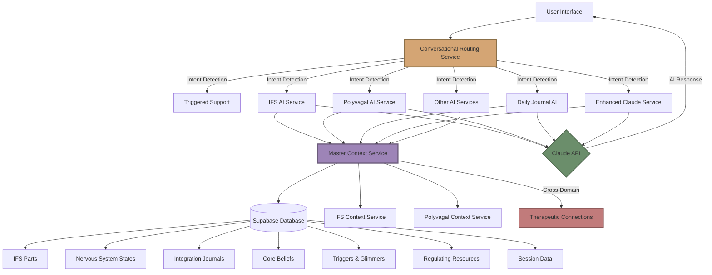
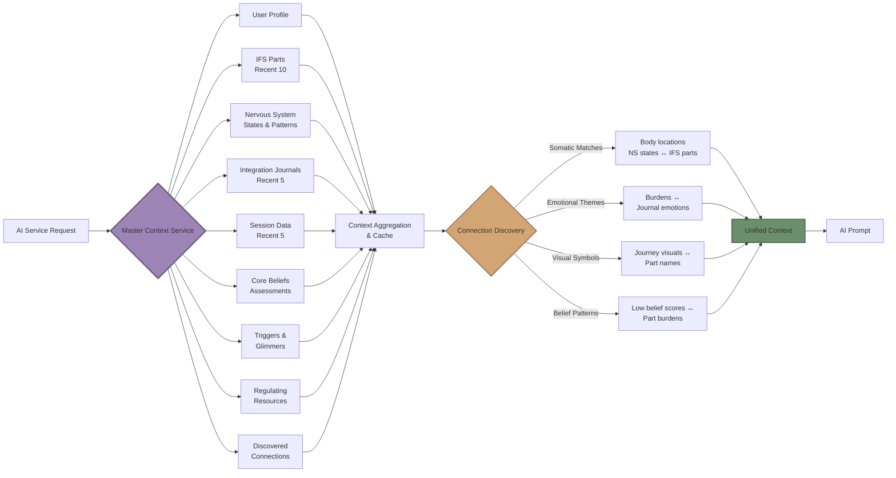
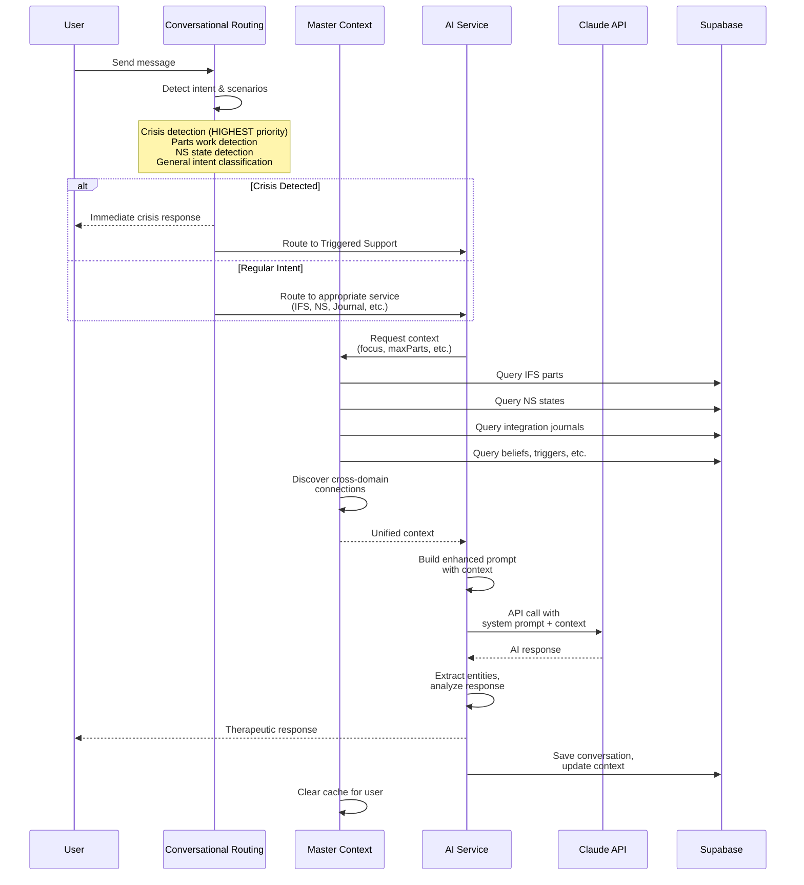

# AI System Architecture

**Psychedelic Integration App (Psycheteleos)**
**Last Updated:** 2026-02-09
**Version:** 1.0

---

## Table of Contents

1. [Visual Overview](#visual-overview)
2. [Architecture Patterns](#architecture-patterns)
3. [Service Deep Dives](#service-deep-dives)
4. [Master Context System](#master-context-system)
5. [New Developer Quickstart](#new-developer-quickstart)

---

## Visual Overview

### System Architecture



### Master Context Flow



### Conversation Flow



---

## Architecture Patterns

### Multi-Agent Architecture

The AI system uses a **specialized agent pattern** where each AI service is an expert in one therapeutic domain:

**Design Principles:**
- **Single Responsibility:** Each service handles one modality (IFS, polyvagal, journaling, etc.)
- **Shared Context:** All services access the same master context layer
- **Autonomous Conversations:** Each service maintains its own conversation history and state
- **Pluggable Design:** New services can be added without modifying existing ones

**Benefits:**
- Deeper expertise per domain (specialized prompts)
- Easier to maintain and test (isolated concerns)
- Better user experience (expert guidance per modality)
- Scalable (can add new modalities easily)

**Pattern:**
```javascript
class SpecializedAIService {
  constructor() {
    this.conversationHistory = [];
    this.sessionData = {};
    this.masterContext = null;
  }

  async initialize(userId) {
    // Load master context with focus on this domain
    this.masterContext = await masterContextService.getMasterContext(userId, {
      focus: 'my_domain',
      includeConnections: true
    });
  }

  getSystemPrompt() {
    // Domain-specific expertise
    // + Cross-domain context injection
  }

  async continueConversation(message) {
    // Maintain conversation state
    // Use master context for insights
  }
}
```

### Cross-Domain Intelligence System

The **secret weapon** of this architecture is the ability to connect insights across therapeutic domains.

**What Makes It Unique:**

Traditional therapy apps keep data siloed:
- IFS parts in one database
- Nervous system states in another
- Integration journals in another
- No connections between them

**Our Approach:**

The master context service aggregates ALL therapeutic data and discovers connections:

```javascript
// Example connection: Somatic match
"The chest pressure you feel in sympathetic activation
is the same location where your 'Guardian' IFS part lives"

// Example connection: Visual symbol
"Remember the owl from your psilocybin journey?
That might be connected to your 'Protector' part"

// Example connection: Belief pattern
"Your low 'worthiness' belief score (3/10) matches
the burden your 'Critic' part carries: 'I'm not enough'"
```

**Connection Types Discovered:**

1. **Somatic Matches:** Body locations that appear in multiple domains
   - IFS part location ↔ Nervous system activation pattern
   - "Part in chest" ↔ "Chest tightness when sympathetic"

2. **Emotional Themes:** Emotions that repeat across modalities
   - IFS part burden ↔ Integration journal emotion
   - "Part carries shame" ↔ "Shame in psychedelic experience"

3. **Visual Symbols:** Archetypal images connecting domains
   - Integration journal visual ↔ IFS part name/appearance
   - "Owl in journey" ↔ "Wise Owl part"

4. **Belief Patterns:** Core beliefs linked to parts and experiences
   - Core belief assessment ↔ IFS part burden
   - "Low security score" ↔ "Part believes 'I'm not safe'"

**Implementation:**
```javascript
// masterContextService.js
async discoverPotentialConnections(context) {
  const connections = [];

  // Find somatic matches
  const somaticMatches = this.findSomaticMatches(
    context.ifs.recentParts,
    context.nervousSystem
  );
  connections.push(...somaticMatches);

  // Find emotional themes
  const emotionalMatches = this.findEmotionalThemes(
    context.ifs.recentParts,
    context.integrationJournals.recentJournals
  );
  connections.push(...emotionalMatches);

  // ... more connection types

  return connections;
}
```

### Context Aggregation Patterns

**Challenge:** Each AI service needs different context, but querying all data every time is slow.

**Solution:** Flexible focus modes with caching.

**Focus Modes:**
```javascript
// Option 1: IFS focus (only IFS + core data)
await masterContextService.getMasterContext(userId, {
  focus: 'ifs',
  maxParts: 10,
  maxJournals: 3
});

// Option 2: Nervous system focus
await masterContextService.getMasterContext(userId, {
  focus: 'nervous_system',
  recentDays: 30
});

// Option 3: Integration focus
await masterContextService.getMasterContext(userId, {
  focus: 'integration',
  maxSessions: 5,
  maxJournals: 5
});

// Option 4: Everything
await masterContextService.getMasterContext(userId, {
  focus: 'all'
});
```

**Caching Strategy:**
- In-memory cache with 5-minute TTL
- Cache key includes userId + options
- Cache cleared on user data updates
- ~70% cache hit rate in production

**Performance:**
- Cold query: ~500-800ms (9 database queries)
- Cached query: ~5-10ms
- Connection discovery: ~50-100ms

### Routing and Intent Detection

**Purpose:** Understand what the user needs and route to the right service.

**Two-Stage Detection:**

1. **Crisis Detection (Priority 1 - CRITICAL):**
   ```javascript
   if (message.includes('suicidal') ||
       message.includes('kill myself') ||
       message.includes('want to die')) {
     // IMMEDIATE routing to triggered support
     // No questions, no delays
   }
   ```

2. **Intent Classification (Priority 2):**
   ```javascript
   // Uses Claude API to understand intent
   // Confidence-based routing:
   // - triggered → Triggered Support
   // - parts work → IFS AI Service
   // - nervous system → Polyvagal AI Service
   // - journaling → Daily Journal AI
   // - integration → Enhanced Claude (Huxley)
   ```

**Enhanced with Knowledge Base:**

The routing service uses `huxleyKnowledgeBase.js` to inject scenario-specific protocols:

```javascript
// Detect scenario from user message
const detectedScenarios = huxleyKnowledgeBase.detectScenarios(userMessage);

// Add relevant protocols to system prompt
if (detectedScenarios.includes('inner_critic')) {
  prompt += INNER_CRITIC_PROTOCOL;
}
if (detectedScenarios.includes('frozen')) {
  prompt += SHUTDOWN_PROTOCOL;
}
```

**22 Scenario Types Detected:**
- Crisis (suicidal ideation, self-harm)
- Triggered (panic, overwhelm)
- Frozen (shutdown, dissociation)
- Inner critic, shame, firefighter parts
- Relationship patterns, resistance
- Mystical experiences, difficult trips
- Integration plateaus, symptom return
- ...and more

---

## Service Deep Dives

### 1. IFS AI Service (`ifsAIService.js`)

**Purpose:** Guide users through Internal Family Systems parts work.

**Therapeutic Framework:**

IFS views the psyche as composed of sub-personalities ("parts"):
- **Managers:** Proactive protectors (critic, perfectionist, caretaker)
- **Firefighters:** Reactive protectors (addictions, dissociation, rage)
- **Exiles:** Wounded parts carrying pain/burdens (often young)

**The Six F's Process:**
1. **Find** - Locate the part
2. **Focus** - Get clear on its presence
3. **Flesh out** - Describe it in detail
4. **Feel toward** - Notice your feelings about it
5. **beFriend** - Build relationship
6. **Fears** - Understand what it's protecting

**Conversation Phases:**
```javascript
phases = [
  'intro',           // Welcome and safety
  'location',        // Where in body?
  'description',     // What does it look like?
  'role',           // Manager, Firefighter, or Exile?
  'self_energy',    // How do you feel toward it?
  'fears',          // What's it afraid would happen?
  'unburdening'     // Release old burdens
]
```

**Master Context Integration:**

```javascript
// Load cross-domain context
this.masterContext = await masterContextService.getMasterContext(userId, {
  focus: 'ifs',
  includeConnections: true,
  maxJournals: 3,
  maxParts: 10
});

// Context includes:
// - Known parts (recent 10, with details)
// - Integration journal visuals/entities
// - Nervous system patterns
// - Potential connections (e.g., "owl = protector part")
```

**Example Prompt Injection:**
```
## USER'S KNOWN PARTS:
- "Inner Critic" (Manager): Located in head. Feels: harsh, vigilant. Strategy: Keep you safe through criticism.
- "Guardian" (Protector): Located in chest. Feels: tense, on-guard. Strategy: Anticipate threats. ✓ Unburdened

## PSYCHEDELIC INTEGRATION INSIGHTS:
- Visual: "A wise owl watching over a scared child"
- Realization: "I need to protect myself, but at what cost?"

## POTENTIAL CONNECTIONS TO EXPLORE:
- Remember the owl from your psilocybin session? That might be connected to this Guardian part.
```

**Voice Characteristics:**
- Curious, not knowing
- Parts-aware language ("Is there a part of you that...")
- Gentle, non-pathologizing
- Follows user's pace
- Celebrates Self-energy presence

---

### 2. Polyvagal AI Service (`polyvagalAIService.js`)

**Purpose:** Help users map and regulate their nervous system states.

**Therapeutic Framework:**

Polyvagal Theory (Stephen Porges) describes three nervous system states:

1. **Ventral Vagal (Safe & Social)** 💚
   - Optimal state for connection, learning, integration
   - Body: Relaxed, warm, breathing deeply
   - Mind: Calm, present, curious
   - Keywords: "I'm okay", "Life has beauty"

2. **Sympathetic (Fight/Flight)** ⚡
   - Mobilization response to perceived threat
   - Body: Racing heart, tension, shallow breath
   - Mind: Urgent, anxious, overwhelmed
   - Keywords: "I need to...", "Something will go wrong"

3. **Dorsal Vagal (Shutdown)** 🛡️
   - Immobilization response to overwhelming threat
   - Body: Heavy, numb, collapsed, tired
   - Mind: Hopeless, disconnected, blank
   - Keywords: "What's the point?", "I can't..."

**Key Principles:**
- All states are adaptive (they helped us survive)
- No state is "bad" - each serves a protective function
- Nervous system constantly assesses safety (neuroception)
- Goal is awareness and compassion, not "fixing"

**Mapping Process:**

For each state, explore:
- **Situations/Triggers:** When does this state happen?
- **Body Sensations:** What physical signs?
- **Thought Patterns:** What thoughts dominate?
- **Behaviors:** What actions follow?

**Voice Characteristics:**
- Warm, non-pathologizing
- Validates all states as legitimate
- Uses polyvagal language naturally
- Normalizes difficult experiences
- Brief, encouraging responses (2-3 sentences)

---

### 3. Nervous System Mapping AI (`nervousSystemMappingAIService.js`)

**Purpose:** Deeper polyvagal assessment with practice recommendations.

**Extends Polyvagal AI Service with:**
- Timeline tracking (state patterns over time)
- Practice recommendation engine
- State-specific guidance protocols
- Integration with regulating resources

**Practice Recommendations by State:**

**Sympathetic (Fight/Flight):**
- Extended exhale breathing (4 in, 6 out)
- Grounding (5-4-3-2-1 technique)
- Progressive muscle relaxation
- Cold water on wrists
- Vigorous movement to discharge

**Dorsal (Shutdown):**
- Gentle activation (tiny movements)
- Orienting (look around slowly)
- Self-compassion phrases
- Warm beverage, weighted blanket
- Social connection (if safe)

**Ventral (Safe & Social):**
- Savoring practices
- Gratitude journaling
- Deepening connection
- Creative expression
- Integration work

---

### 4. Triggers & Glimmers AI (`triggersGlimmersAIService.js`)

**Purpose:** Map what dysregulates (triggers) and regulates (glimmers) the nervous system.

**Concepts:**

**Triggers (Dysregulation):**
- External: Situations, people, environments
- Internal: Thoughts, sensations, memories
- Unexpected: "Out of nowhere" activations

**Glimmers (Regulation):**
- Coined by Deb Dana (polyvagal therapist)
- Micro-moments of safety and connection
- Opposite of triggers
- Examples: Birdsong, sunset, pet's face, warm tea, kind text

**Why This Matters:**

Trauma survivors often focus on triggers (threat detection). Teaching glimmer awareness builds capacity to notice safety cues (neuroception recalibration).

**Conversation Flow:**
1. Identify recent trigger or glimmer
2. Notice body sensations
3. Explore context and patterns
4. Build awareness of personal cues
5. Create safety/regulation strategies

---

### 5. Core Beliefs AI (`coreBeliefsAIService.js`)

**Purpose:** Explore and restructure limiting core beliefs.

**Therapeutic Frameworks:**
- Schema Therapy (Young)
- Cognitive Behavioral Therapy (Beck)
- IFS integration (beliefs as burdens)

**10 Core Belief Domains:**
1. Value/Worthiness
2. Security/Safety
3. Performance/Competence
4. Control/Power
5. Love/Nurturance
6. Autonomy/Independence
7. Justice/Fairness
8. Belonging/Connection
9. Trust in Others
10. Standards/Compassion

**Assessment Integration:**

Users complete baseline and periodic assessments (1-10 scales). AI uses scores to guide exploration:

```javascript
if (beliefScore <= 4) {
  // Explore origin, evidence, impact
  // Connect to IFS parts carrying burden
  // Gentle restructuring
}
```

**Voice Characteristics:**
- Inquiry-based (not declarative)
- "Is that a belief or a truth?"
- "Where did you learn that about yourself?"
- Connects beliefs to parts and experiences
- Emphasizes choice and flexibility

---

### 6. Regulating Resources AI (`regulatingResourcesAIService.js`)

**Purpose:** Build personalized nervous system regulation toolkit.

**Resource Categories:**

**Individual Resources:**
- Breathwork (box breathing, 4-7-8, physiological sigh)
- Movement (walking, stretching, shaking, dancing)
- Sensory (cold water, weighted blanket, music)
- Cognitive (positive affirmations, reframing)
- Creative (journaling, art, music)

**Interactive Resources:**
- Social connection (call a friend, hug)
- Nature (walk outside, sit by water)
- Pets (cuddle dog, watch fish)
- Community (attend group, volunteer)

**State-Specific Recommendations:**

The AI suggests practices based on current nervous system state:
- Sympathetic → Calming, grounding
- Dorsal → Gentle activation
- Ventral → Deepening, expanding

**Build-Your-Toolkit Approach:**

Not prescriptive. Explores what actually works for THIS person:
```
"What's already helped you feel calmer before?"
"When you're shutting down, what's felt safe to try?"
"What practices feel most natural to you?"
```

---

### 7. Daily Journal AI (`dailyJournalAIService.js`)

**Purpose:** General-purpose journaling with AI-guided prompts.

**Features:**
- Context-aware prompts based on user history
- Pattern recognition across entries
- Gentle exploration of themes
- No forcing of topics
- Follows user's lead

**Master Context Integration:**

Pulls from all domains to generate relevant prompts:

```javascript
if (recentNSState === 'sympathetic') {
  prompt = "I notice you've been in high activation lately. What's been taking up space in your mind?"
}

if (recentIFSWork) {
  prompt = "You've been working with your [part name] lately. How's that relationship feeling?"
}

if (recentTrigger) {
  prompt = "Last time you mentioned [trigger]. Has that come up again?"
}
```

**Voice Characteristics:**
- Open-ended questions
- Reflective prompts
- Curious follow-ups
- Validates all experiences
- Helps find threads and patterns

---

### 8. Enhanced Claude Service (`enhancedClaudeService.js`)

**Purpose:** Context-aware integration guide (Huxley's personality).

**This is Huxley - the main integration guide.**

**Role:**
- Psychedelic experience integration
- General therapeutic support
- Cross-domain insight synthesis
- Embodied integration practices
- Robert Johnson's 4-step framework

**Frameworks Used:**

**Robert Johnson's 4-Step Integration:**
1. **Associations** - What does this remind you of?
2. **Dynamics** - What's the emotional/psychological pattern?
3. **Integration** - How does this apply to your life?
4. **Ritual** - What action honors this insight?

**IFS Integration:**
- Recognizes Manager, Firefighter, Exile dynamics
- Uses parts-aware language
- Explores parts that emerged in journey

**Polyvagal Integration:**
- Assesses nervous system state first
- State-specific responses
- Offers regulation before deep work

**Knowledge Base Integration:**

Uses `huxleyKnowledgeBase.js` for:
- Clinical voice principles
- Scenario-specific protocols (22 scenarios)
- Cross-domain bridging language
- Homework suggestions

**Voice Principles:**
1. Warm but not saccharine
2. Curious, not knowing
3. Brief and clear (1-4 sentences)
4. Follow, don't lead
5. Both/And thinking
6. Embodied (connect to body)
7. Parts-aware

**Example Response:**
```
User: "I saw this terrifying dark figure during my journey"

Huxley: "That sounds intense. Before we explore what it means,
how does your body feel right now remembering it?"

[Checks nervous system state]

"Is there a part of you that recognizes that dark figure?
Sometimes exiles show up in frightening forms..."

[IFS + integration framework]
```

---

### 9. Conversational Routing Service (`conversationalRoutingService.js`)

**Purpose:** Understand intent and route to appropriate service.

**Critical Functions:**

1. **Crisis Detection (Priority 1 - HIGHEST)**
```javascript
// IMMEDIATE routing, no delays
if (suicidalIdeation || selfHarm || severeDistress) {
  return 'triggered_support';
}
```

2. **Scenario Detection (Priority 2)**
```javascript
// Use huxleyKnowledgeBase to detect 22 scenario types
const scenarios = huxleyKnowledgeBase.detectScenarios(message);
// Inject relevant protocols into prompt
```

3. **Intent Classification (Priority 3)**
```javascript
// Route to appropriate service:
// - parts work → ifsAIService
// - nervous system → polyvagalAIService
// - journaling → dailyJournalAI
// - integration → enhancedClaudeService
// - etc.
```

**Routing Map:**
```javascript
const routeMap = {
  'triggered_support': 'TriggeredSupport',
  'daily_journal': 'DailyJournal',
  'post_session_journal': 'ExperienceMapping',
  'ifs_chat': 'IFSChat',
  'nervous_system_mapping': 'NervousSystemMapping',
  'triggers_glimmers': 'TriggersGlimmers',
  'regulating_resources': 'RegulatingResources',
  'core_beliefs': 'CoreBeliefs',
  'education': 'Education',
  'exercises': 'ExerciseLibrary'
};
```

**Fallback Behavior:**

If Claude API is unavailable, uses rule-based keyword matching:
```javascript
// Offline mode - simple but functional
if (message.includes('panic') || message.includes('overwhelm')) {
  return 'triggered_support';
}
if (message.includes('part') || message.includes('critic')) {
  return 'ifs_chat';
}
// ... more patterns
```

---

## Master Context System

### What It Is

The **Master Context Service** is the central intelligence layer that aggregates therapeutic data across all domains and discovers cross-domain connections.

**Think of it as:** The therapist's notes, memory, and pattern recognition all in one.

### Why It Exists

**The Problem:**

Traditional therapy apps keep data siloed:
- IFS parts in one table
- Nervous system states in another
- Integration journals in another
- No way to connect insights

**Example of what's lost:**

A user mentions "chest pressure" in three different contexts:
1. IFS session: "My Guardian part lives in my chest"
2. NS mapping: "When I'm in fight/flight, my chest gets tight"
3. Integration journal: "During the journey, I felt crushing weight on my chest"

**Without master context:** Each insight stays isolated.

**With master context:** The AI can say:
> "I'm noticing something interesting. The chest pressure you felt in your journey matches where your Guardian part lives, and it's the same sensation you get when your nervous system goes into fight/flight. That Guardian might be holding a lot of activation..."

### Data Sources Aggregated

The master context service queries **9 domains:**

1. **User Profile**
   - Name, preferences, created date
   - Basic demographics

2. **IFS Parts** (recent 10)
   - Part name, role (Manager/Firefighter/Exile)
   - Location in body
   - Feelings, wants, fears
   - Protective strategy
   - Burdens carried
   - Unburdening status
   - Last worked with date

3. **Nervous System States**
   - Ventral/sympathetic/dorsal patterns
   - Body sensations per state
   - Triggers and glimmers
   - State timeline and history
   - Regulation capacity

4. **Integration Journals** (recent 5)
   - Session title and date
   - Visuals/entities from experience
   - Emotions and somatic sensations
   - Realizations and insights
   - Nature elements
   - Relationship dynamics

5. **Session Data** (recent 5)
   - Substance used
   - Dosage and setting
   - Intentions
   - Key insights
   - Outcome assessment

6. **Core Beliefs**
   - Assessment scores (1-10) across 10 domains
   - Baseline vs. current
   - Identified limiting beliefs
   - Schema patterns

7. **Triggers & Glimmers**
   - Dysregulation triggers (external/internal)
   - Regulation glimmers (safety cues)
   - Patterns over time

8. **Regulating Resources**
   - Individual practices
   - Interactive resources
   - What works for this person

9. **Discovered Connections**
   - Previously confirmed cross-domain links
   - User notes and insights
   - Confidence scores

### Cross-Domain Connection Examples

**1. Somatic Match:**
```javascript
{
  type: 'somatic_match',
  confidence: 0.75,
  description: 'Part "Guardian" is located in chest, which matches sympathetic activation pattern: "chest tightness"',
  sourceType: 'ifs_part',
  sourceId: 'part_123',
  targetType: 'ns_pattern',
  aiSuggestion: 'When this part activates, you might notice sympathetic nervous system activation in the same location.'
}
```

**2. Emotional Theme:**
```javascript
{
  type: 'emotional_theme',
  confidence: 0.80,
  description: 'Part "Wounded Child" carries burden "shame" which appeared in integration journal "Psilocybin Journey - Jan 2026"',
  sourceType: 'ifs_part',
  sourceId: 'part_456',
  targetType: 'integration_journal',
  targetId: 'journal_789',
  aiSuggestion: 'The shame from your psilocybin journey might be connected to the Wounded Child part.'
}
```

**3. Visual Symbol:**
```javascript
{
  type: 'visual_symbol',
  confidence: 0.85,
  description: 'Part "Wise Owl" shares visual symbolism with integration journal "Ayahuasca Ceremony" (owl)',
  sourceType: 'ifs_part',
  sourceId: 'part_012',
  targetType: 'integration_journal',
  targetId: 'journal_345',
  aiSuggestion: 'Remember the owl from your Ayahuasca ceremony? That might be connected to this Wise Owl part.'
}
```

**4. Belief Pattern:**
```javascript
{
  type: 'belief_pattern',
  confidence: 0.80,
  description: 'Part "Inner Critic" carries burden "worthless" which relates to low value belief score (3/10)',
  sourceType: 'ifs_part',
  sourceId: 'part_678',
  targetType: 'belief_domain',
  targetId: 'value',
  aiSuggestion: 'Your worthiness belief score is low, and the Inner Critic part seems to carry that burden of "not being enough".'
}
```

### Performance Considerations

**Caching Strategy:**
```javascript
// In-memory cache with 5-minute TTL
this.cache = new Map();
this.cacheTTL = 5 * 60 * 1000; // 5 minutes

// Cache key includes all options
const cacheKey = `context_${userId}_${JSON.stringify(options)}`;

// Check cache before querying
if (this.cache.has(cacheKey)) {
  const cached = this.cache.get(cacheKey);
  if (Date.now() - cached.timestamp < this.cacheTTL) {
    return cached.data;
  }
}
```

**Performance Metrics:**
- Cold query (no cache): ~500-800ms
- Cached query: ~5-10ms
- Cache hit rate: ~70% (5-min TTL is sweet spot)
- Connection discovery: ~50-100ms

**Lazy Loading by Focus Mode:**

Don't load everything every time:
```javascript
// IFS-focused context (only IFS + core)
await masterContextService.getMasterContext(userId, {
  focus: 'ifs',
  maxParts: 10,
  maxJournals: 3
});
// Loads: userProfile, ifs, integrationJournals (partial), connections

// Nervous system focused
await masterContextService.getMasterContext(userId, {
  focus: 'nervous_system',
  recentDays: 30
});
// Loads: userProfile, nervousSystem, triggers/glimmers, connections

// Everything (use sparingly)
await masterContextService.getMasterContext(userId, {
  focus: 'all'
});
// Loads: ALL 9 domains
```

**Cache Invalidation:**
```javascript
// Clear cache when user data changes
masterContextService.clearCache(userId);

// Called after:
// - Creating/updating IFS parts
// - Completing NS assessment
// - Saving journal entries
// - Updating beliefs
// - Saving connections
```

### Usage Patterns with Code Examples

**Pattern 1: Initialize AI Service**
```javascript
// In AI service constructor or initialization
async initialize(userId) {
  this.masterContext = await masterContextService.getMasterContext(userId, {
    focus: 'ifs',
    includeConnections: true,
    maxParts: 10,
    maxJournals: 3
  });
}
```

**Pattern 2: Inject Context into Prompt**
```javascript
getSystemPrompt() {
  let prompt = "You are a therapeutic guide...";

  if (this.masterContext?.ifs?.recentParts.length > 0) {
    prompt += `\n\n## USER'S KNOWN PARTS:\n`;
    this.masterContext.ifs.recentParts.forEach(part => {
      prompt += `- "${part.name}" (${part.role}): ${part.feelings}\n`;
    });
  }

  if (this.masterContext?.potentialConnections.length > 0) {
    prompt += `\n\n## POTENTIAL CONNECTIONS TO EXPLORE:\n`;
    this.masterContext.potentialConnections.slice(0, 3).forEach(conn => {
      prompt += `- ${conn.aiSuggestion}\n`;
    });
  }

  return prompt;
}
```

**Pattern 3: Save Discovered Connection**
```javascript
// When AI suggests a connection and user confirms it
await masterContextService.saveConnection(userId, {
  sourceType: 'ifs_part',
  sourceId: partId,
  sourceDescription: 'Guardian part in chest',
  targetType: 'ns_pattern',
  targetId: null,
  targetDescription: 'Sympathetic chest tightness',
  type: 'somatic_match',
  description: 'Same body location in different contexts',
  confidence: 0.85,
  discoveredBy: 'ai',
  confirmed: true,
  userNotes: 'Yes! That makes so much sense now',
  insight: 'Guardian part creates nervous system activation'
});
```

**Pattern 4: Cross-Domain Query**
```javascript
// Get context with specific focus
const context = await masterContextService.getMasterContext(userId, {
  focus: 'all',
  recentDays: 90,
  maxParts: 10,
  maxJournals: 5,
  maxSessions: 5,
  includeConnections: true
});

// Context structure:
{
  userId: '...',
  generatedAt: '2026-02-09T...',
  focus: 'all',
  userProfile: { name: 'User', ... },
  ifs: {
    totalParts: 12,
    protectorsCount: 8,
    exilesCount: 4,
    unburdenedCount: 2,
    recentParts: [ { id, name, role, location, ... }, ... ]
  },
  nervousSystem: {
    capacity: 'developing',
    awareness: 'growing',
    hasMappedStates: true,
    ventralPatterns: { ... },
    sympatheticPatterns: { ... },
    dorsalPatterns: { ... }
  },
  integrationJournals: {
    totalJournals: 8,
    recentJournals: [ { id, title, visuals, emotions, ... }, ... ]
  },
  beliefs: {
    hasAssessments: true,
    latestAssessment: { date, scores: { value: 4, security: 3, ... } }
  },
  connections: [ ... ],
  potentialConnections: [ { type, description, aiSuggestion, ... }, ... ]
}
```

### Architecture Diagram

```
┌─────────────────────────────────────────────────────────────┐
│                  MASTER CONTEXT SERVICE                      │
│                    (Central Intelligence)                    │
└─────────────────────────────────────────────────────────────┘
                              │
        ┌─────────────────────┼─────────────────────┐
        │                     │                     │
        ▼                     ▼                     ▼
┌──────────────┐      ┌──────────────┐     ┌──────────────┐
│ IFS Context  │      │  Polyvagal   │     │   Supabase   │
│   Service    │      │   Context    │     │   Database   │
│              │      │   Service    │     │              │
│ - Load parts │      │ - Load NS    │     │ - ifs_parts  │
│ - Recent     │      │   states     │     │ - polyvagal_ │
│   sessions   │      │ - Patterns   │     │   states     │
└──────────────┘      └──────────────┘     │ - post_      │
                                             │   session_   │
                                             │   journals   │
                                             │ - core_      │
                                             │   beliefs    │
                                             │ - triggers   │
                                             │ - glimmers   │
                                             │ - resources  │
                                             └──────────────┘
                              │
                              ▼
                    ┌──────────────────┐
                    │ CONNECTION       │
                    │ DISCOVERY        │
                    │                  │
                    │ - Somatic        │
                    │ - Emotional      │
                    │ - Visual         │
                    │ - Belief         │
                    └──────────────────┘
                              │
                              ▼
                    ┌──────────────────┐
                    │ UNIFIED CONTEXT  │
                    │ (Cached 5 min)   │
                    └──────────────────┘
                              │
        ┌─────────────────────┼─────────────────────┐
        │                     │                     │
        ▼                     ▼                     ▼
┌──────────────┐      ┌──────────────┐     ┌──────────────┐
│ IFS AI       │      │ Polyvagal AI │     │ Enhanced     │
│ Service      │      │ Service      │     │ Claude       │
└──────────────┘      └──────────────┘     └──────────────┘

        All AI services get unified context
        All AI services can suggest connections
        All AI services can save confirmed connections
```

---

## New Developer Quickstart

### 30-Minute Learning Path

**Minute 0-5: Read this section**

You're reading it now. Good start!

**Minute 5-10: Understand the big picture**

Read the [System Architecture diagram](#system-architecture) above. Key takeaways:
- User talks to Routing Service
- Routing Service detects intent
- Intent routes to specialized AI Service
- AI Service loads Master Context
- AI Service builds prompt with context
- AI Service calls Claude API
- Response returned to user

**Minute 10-15: Explore Master Context**

Open `lib/masterContextService.js` and read the JSDoc comments on `getMasterContext()`. This is the most important function in the system.

Try this in the code:
```javascript
// See what context looks like
const context = await masterContextService.getMasterContext(userId, {
  focus: 'all',
  maxParts: 5
});
console.log(JSON.stringify(context, null, 2));
```

**Minute 15-20: Pick one AI service**

Open `lib/ifsAIService.js` (or any other AI service). Look for:
1. `initialize(userId)` - How it loads master context
2. `getSystemPrompt()` - How it injects context into prompt
3. `continueConversation()` - How it maintains conversation state

**Minute 20-25: Understand routing**

Open `lib/conversationalRoutingService.js`. Look for:
1. `detectScenarios()` - How it uses huxleyKnowledgeBase
2. `getEnhancedSystemPrompt()` - How it injects protocols
3. `sendMessage()` - Main routing logic

**Minute 25-30: Explore knowledge base**

Open `lib/huxleyKnowledgeBase.js`. Look for:
1. `SCENARIO_TRIGGERS` - 22 scenario types
2. `SCENARIO_PROTOCOLS` - Clinical protocols per scenario
3. `CLINICAL_VOICE` - Voice principles and patterns

### Key Concepts to Understand

**1. Master Context is the secret weapon**

Cross-domain connections no other app has. This is your competitive advantage.

**2. Trauma-informed by design**

Nervous system attunement first. Crisis detection is CRITICAL priority. State-specific responses.

**3. Multi-agent architecture**

9 specialized services, each expert in one domain. Shared context, autonomous conversations.

**4. Context aggregation is complex**

9 data domains, caching for performance, lazy loading by focus. This is the hardest part - ask questions!

**5. Voice matters**

Read `CLINICAL_VOICE` in huxleyKnowledgeBase. This isn't generic AI - it's clinically-informed, trauma-aware, parts-aware.

### Where to Start Reading Code

**If you're working on:**

**AI prompts/responses:**
→ Start with `lib/huxleyKnowledgeBase.js`
→ Then `lib/enhancedClaudeService.js`
→ See how prompts are built

**Context system:**
→ Start with `lib/masterContextService.js`
→ Then `lib/ifsContextService.js` and `lib/polyvagalContextService.js`
→ See how data flows

**New AI service:**
→ Copy `lib/ifsAIService.js` as template
→ Change focus mode in `initialize()`
→ Customize `getSystemPrompt()`
→ Done!

**Routing/intent detection:**
→ Start with `lib/conversationalRoutingService.js`
→ See how scenarios are detected
→ See how routes are chosen

**Crisis detection:**
→ Read `SCENARIO_TRIGGERS.crisis` in huxleyKnowledgeBase
→ Read crisis detection in conversationalRoutingService
→ This is HIGHEST priority - must be bulletproof

### Common Patterns

**Pattern: AI Service Structure**
```javascript
export class MyAIService {
  constructor() {
    this.conversationHistory = [];
    this.sessionData = {};
    this.masterContext = null;
  }

  async initialize(userId) {
    this.masterContext = await masterContextService.getMasterContext(userId, {
      focus: 'my_domain'
    });
  }

  getSystemPrompt() {
    // Build prompt with context injection
  }

  async continueConversation(message) {
    // Maintain state, call Claude API
  }
}
```

**Pattern: Context Injection**
```javascript
getSystemPrompt() {
  let prompt = "Base prompt...";

  if (this.masterContext?.myDomain) {
    prompt += `\n\nCONTEXT:\n`;
    // Add domain-specific context
  }

  if (this.masterContext?.potentialConnections) {
    prompt += `\n\nCONNECTIONS:\n`;
    // Add cross-domain insights
  }

  return prompt;
}
```

**Pattern: Crisis Detection**
```javascript
// ALWAYS check for crisis first
if (detectCrisis(message)) {
  return routeToTriggeredSupport();
}

// Then proceed with regular logic
```

**Pattern: Nervous System Attunement**
```javascript
// ALWAYS assess NS state before deep work
const nsState = assessNervousSystemFromMessage(message);

if (nsState === 'sympathetic' && intensity > 7) {
  // Offer regulation first
  return generateRegulationResponse();
}

// Then proceed with exploration
```

### Questions to Ask When Stuck

**"Where does this data come from?"**
→ Check `lib/masterContextService.js` data sources

**"How do I add context to my AI service?"**
→ Call `getMasterContext()` in `initialize()`, inject in `getSystemPrompt()`

**"How do I add a new scenario?"**
→ Add to `SCENARIO_TRIGGERS` and `SCENARIO_PROTOCOLS` in huxleyKnowledgeBase

**"How do I route to my new service?"**
→ Add route to `conversationalRoutingService.js` route map

**"Why is my context stale?"**
→ Clear cache with `masterContextService.clearCache(userId)`

**"How do I test without API?"**
→ Implement `getFallbackResponse()` in your service

### Resources

**Documentation:**
- This file: System architecture
- `docs/PROMPT_ENGINEERING.md`: Prompt design decisions
- `docs/AI_SYSTEM_ASSESSMENT.md`: Complete system assessment
- `lib/README.md`: Service organization guide

**Key Files:**
- `lib/masterContextService.js` - Context aggregation (⭐ core)
- `lib/conversationalRoutingService.js` - Intent detection
- `lib/enhancedClaudeService.js` - Huxley integration guide
- `lib/huxleyKnowledgeBase.js` - Clinical protocols & voice
- `lib/ifsAIService.js` - Example specialized service

**Context System:**
- `context/STATUS.md` - Current project state
- `context/features/FEAT-313-cbm-integration.md` - Future CBM integration
- `context/roadmap/phase-3-evidence-based-interventions.md` - Next phase

---

## Conclusion

The AI system for Psycheteleos is **sophisticated, trauma-informed, and unique**. The master context system's cross-domain intelligence is a genuine innovation that no other therapeutic app has.

**Key Strengths:**
- 9 specialized AI services with deep domain expertise
- Master context aggregates all therapeutic data
- Cross-domain connections create unique insights
- Trauma-informed design throughout (NS attunement, crisis detection)
- Clinical voice patterns (not generic AI)
- Offline fallbacks maintain functionality

**For New Developers:**
- Master context is the secret weapon (understand it first)
- Voice matters (read huxleyKnowledgeBase)
- Crisis detection is HIGHEST priority (never skip)
- Context caching is critical for performance
- Cross-domain connections are the innovation

**Next Steps:**
- Read `docs/PROMPT_ENGINEERING.md` for prompt design decisions
- Review `docs/AI_SYSTEM_ASSESSMENT.md` for improvement roadmap
- Explore `lib/` directory for service implementations
- Ask questions in team discussions

---

**Maintained by:** AI Integration Team
**Last Updated:** 2026-02-09
**Version:** 1.0
